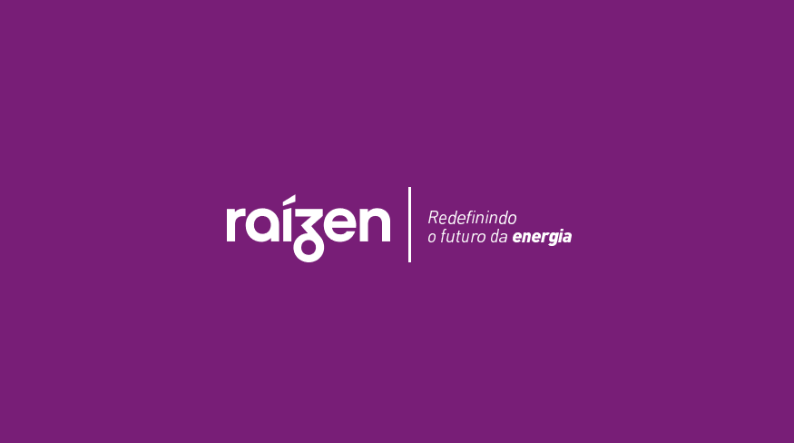

# Talent Fest - Raízen
## Índice

- [1. Introdução](#1-introdução)
- [2. Resumo do projeto](#2-resumo-do-projeto)
- [3. História de Usuário](#3-história-de-usuário)
- [4. Interface](#4-interface)
- [5. Aplicação](#5-aplicação)
- [6. Implementações futuras](#6-implementações-futuras)
- [7. Ferramentas utilizadas](#7-ferramentas-utilizadas)
- [8. Desenvolvedoras](#8-desenvolvedoras)

### 1. Introdução
 

    
  

   

### 2. Resumo do projeto
Projeto desenvolvido durante o Talent Fest, Hackathon de 3 dias do Bootcamp da Laboratória. 
#### 2.1 Desafio
A Ráizen nos prospos fazer alterações no layout do Portal de RH, projetando uma melhor acessibilidade para portadores de baixa visão. O objetivo é padronizar e reduzir as burocracias dos processos de Administração de Recursos Humanos. 
O portal centraliza e facilita o acesso e a atualização das informações pessoais e profissionais do colaborador, além de trazer serviços e informações.

A acessibilidade digital tem como principal objetivo facilitar e otimizar o acesso de pessoas com deficiência aos ambientes virtuais, eliminando as barreiras encontradas na web. Por meio dessa prática, é possível utilizar, participar e interagir com autonomia em sites e serviços disponíveis na internet.

Dessa forma, promover a acessibilidade digital é, consequentemente, garantir as condições favoráveis para que todas as pessoas, com ou sem deficiência, possam participar do processo de forma justa.

### 3 História de Usuário 
-- Descrever uma persona e os desafios que ela encontra ao acessar o portal e identificar os pontos de melhorias. --
### 4. Interface
Para o protótipo de alta fidelidade foi utilizada a ferramenta Figma.
Começamos o planejamento estudando e analisando como distribuir o layout, e que ele fosse de fácil navegação e iteração do usuário. 
Foi estruturado alguns modelos com padronagem de cores e análisado em plataforma que simulam contrastes de cores para portadores de baixa visão e daltonismo e após os feedbacks da equipe de apoio foi aprovado o seguinte protótipo:

COLOCAR IMAGEM DO PROTÓTIPO DE ALTA FIDELIDADE
### 5. Aplicação
COLOCAR GIF DA APLICAÇÃO RODANDO
### 6. Implementações futuras
DESCREVER O BOTÃO DE FAVORITAS O CONTEÚDO MAIS UTILIZADO PARA O COLABORADOR
### 7. Ferramentas utilizadas

### 8. Densenvolvido por:
---
<table>
<td>
  

     
  

  <h3 align="center"><a href="https://github.com/dayanersilva" target="_blank">Dayane Rodrigues</a></h3>
  

    
  

</td>
<td>
  

     
  

  <h3 align="center"><a href="https://github.com/erikakrause" target="_blank">Érika Moreno</a></h3>
  

    
  

</td>
<td>
  

     
  

  <h3 align="center"><a href="https://github.com/la4ri" target="_blank">Larissa Moreira</h3>
  

     
  

</td>
<td>
  

     
  

  <h3 align="center"><a href="https://github.com/lidiannerb" target="_blank">Lidianne Barbosa</h3>
  

     
  

</td>
<td>
  

     
  

  <h3 align="center"><a href="https://github.com/ThamaraBortolin" target="_blank">Thâmara Bortolin</a></h3>
  

    
  

</td>
</table>
<table>
